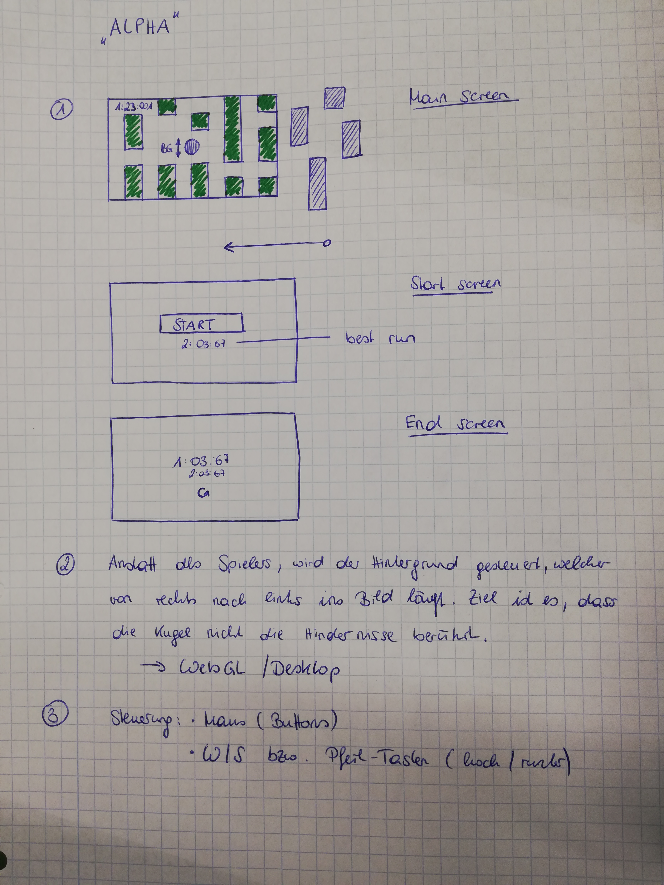

# Progress
100% done. **Important:** this project is a student project, it's not meant to be performant.
* [x] User interface
* [x] Generate world (random)
* [x] Move world
* [x] Add stopwatch
* [x] Player interaction with world (collisions etc.)

# Releases
You'll find the current release (v1.0.0-beta Build 2) under *release*.

# How to build from source?
Just clone the git repo, jump into Unity (2018.2.14f1) and punch the build button.

# What is Alpha?
Alpha is a game developed with Unity and build for desktop and WebGL. Goal of the game is to avoid collision with moving obstacles, entering the screen from right to left. Instead of controlling the character, the user moves the background up and down to avoid collisions.

## Development and target platforms
* Unity 2018.2.14f1
* Visual Studio for Mac 2017 v7.7.2
* Build for desktop and WebGL (1920x1080)

## Resources
* [Orbitron (Font)](https://fonts.google.com/specimen/Orbitron)

## Screenshots

# License
BSD 2-Clause License
